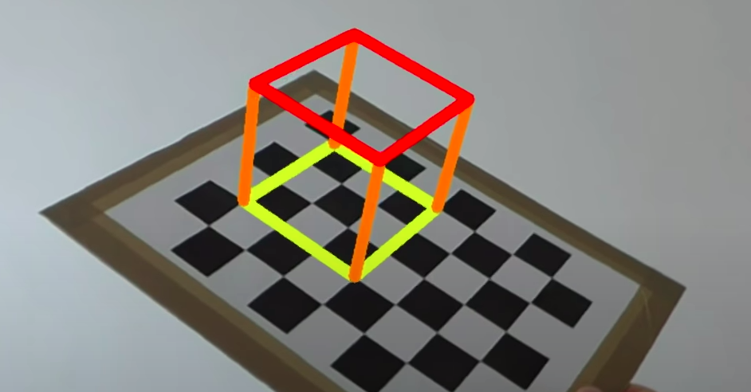
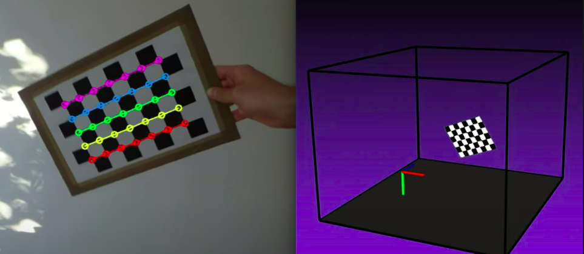

# CameraCalibrations.jl

Camera Calibration algorithms in Julia using JuliaImages ecosystem
  
Idea is to be able to do something like below by end of the year for now:

- determining a camera's intrinsic parameters from a series of images
- common calibration algorithms e.g. zhang, tsai, dlt etc
- work with different calibration targets e.g. chessboard
- 3d reconstructions as shown below
- checkeboard detection algorithm which can provide the necessary inputs to a camera calibration routine
-  projective geometry implementations, camera models, though CoordinateTransformations.jl, CameraModels.jl(by yakir), CameraCalibrations.jl(by yakir), ImageProjectiveGeometry.jl(by peter kovessi) need to be checked to avoid repeated methods

#### Current Update on checkboard detection:

```
using Images
using CameraCalibrations

img = Gray.(load("assets/test.jpg"))
res = process_image(img)
draw_rect(img, res,  Gray(1))
save("results.png", img)
```

##### Results:
| Input image     | Output Image |
| ----------- | ----------- |
|  |  |

##### It would be great to pull off something like below by end of year:



#### References:
-  [Camera Calibration](https://en.wikipedia.org/wiki/Camera_resectioning) - common methods for camera calibration discussed
-  [Farneback method](https://discourse.julialang.org/t/detecting-crosses-in-grids/6720/44) - algorithm for detecting crosses in grid which could be a checkerboard
-  [Above images were taken from here](https://www.youtube.com/watch?v=2hek-DmiGEw)
-  [Input image credit](https://rdmilligan.wordpress.com/2015/06/28/opencv-camera-calibration-and-pose-estimation-using-python/)